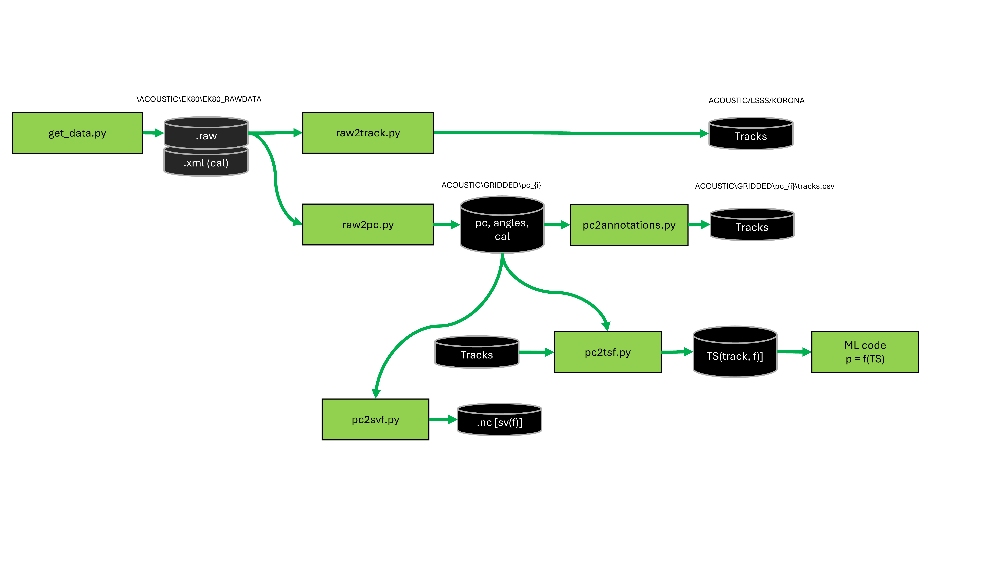

# CRIMAC-FM-testdatapaper

This repository contains code to download, process and visualize the IMR test data sets using a combination of Korona and python libraries.

## Preparations

### Software

It is recommended to use git for obtaining the latest updates for the code. 

The code use `uv` for managing the environment.Installation methods for  `uv` is found [`here`](https://docs.astral.sh/uv/getting-started/installation/) 

### Environmental variables

You need to set the location of the test data as an env variable:

```bash
export CRIMACSCRATCH="/crimac-scratch"`
```


## Download test data

To obtain the latest verion of the test data you need to run 

```bash
uv run python scripts/get_data.py
```.

The data will be downloaded from the Norwegian Marine Data Centre and placed under `${CRIMACSCRATCH}/CRIMAC-FM-testdata`. Each individual test data set will be placed under `/{year}/{testdataset}`. The script generates the file `DataSets.csv` that contains the list of test data sets.

The `uv run python scripts/check_data.py` parses the diretories and count files by file extension per standard directory.


## Scripts for test data processing
Overview of the data processing scripts.



The scripts and function use the following naming conventions:

- raw: Simrad RAW format
- pc: pulse compressed data, NetCDF format
- tracks: individual object tracks, csv format
- annotations: same as track format
- svf: echo per frequency by volume, i.e. S_v(f) values, NetCDF format
- tsf: echo per frequency for individual targets, TS(f), NetCDF format

### process_pipeline_main.py - Run the conversion of test data from raw to pulse compressed

Script to convert raw data to pulse compressed data in netcdf format.

The script reads the raw data for each test data at `ACOUSTIC/EK80/EK80_RAWDATA`, extract metadata from the raw files using ektools, and run the KoronaModule to convert to pulsecompressed data. The output is saved to `ACOUSTIC/GRIDDED/pc_{i}` as net cdf files corresponding to the raw files, where {i} is the ping group number. When multiple ping groups are present in the data, {i} denotes the ping group, otherwise i=1. A figure is generated from the netcdf file and placed in the same folder. .

This uses functionality from `raw2meta`, `raw2pc.py` and `raw2png.py`.

### raw2meta.py - Parse the raw file for metadata
Raw2meta parse the raw file using ektools and extracts the ping groups, and assign the metadata to the ping groups. This is needed when ping sequencing 
are used or when different transducers are multiplexed. Korona does not support ping groups and the data have to be split prior to processing.

This is a library function with a wrapper that allows it to be called as a standalone program.

### raw2pc.py - Convert a directory of RAW files to pusle compressed NetCDF
raw2pc convert the raw files to pulse compressed files (when applicable) for each ping group using korona and KoronaScript.

This is a library function with a wrapper that allows it to be called as a standalone program.

### raw2png.py - Make plots from pulse compressed data
raw2png plots the pulse compressed data from the converted netCDF files.

This is a library function with a wrapper that allows it to be called as a standalone program.


## Scripts for test data processing (development in progree)

### raw2tracks.py - Tracking using Korona
Single target detection and tracking from raw data.

### pc2tracks - track objects from pulse compressed data

### pc2tsf - Estimate TS(f)

Based on the pulsecompressed data and the track definitions, estimate TS(f) per target across all channels.

### pc2tracks - track objects from pulse compressed data

This script reads the pc data and computes Sv(f).


# Linting, formatting and type checking

## Using ruff & ty

* `uv run ruff format .` → Reformatting code
* `uv run ruff check .` → linting
* `uv run ruff check . --fix` → linting with **safe** auto-fixes
* `uv run ty check .` → check for typing errors
